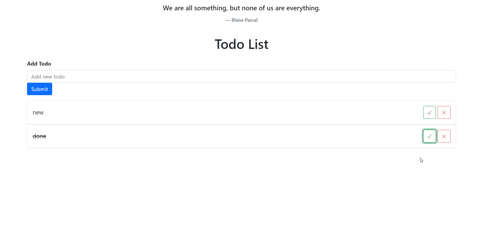

# Todo app in React

## Table of contents

- [Overview](#overview)
  - [The challenge](#the-challenge)
  - [Screenshot](#screenshot)
  - [Links](#links)
- [My process](#my-process)
  - [Built with](#built-with)

## Overview

### The challenge

Users should be able to:

- View the optimal layout for the app depending on their device's screen size
- Add new todos to the list
- Ability to hit ENTER key and add TODO to a list
- Mark todos as complete
- Delete todos from the list
- At the top of the list user should be able to see different inspirational quote each time user refreshes the page
- The quote should be fetched from the following API: https://type.fit/api/quotes
- Persist the TODO’s so that when the user refreshes the page, the list of TODOs is unchanged

### Screenshot

### Links

- [Live Site URL](https://nedimperva.github.io/todo_react/)

## My process

### Built with

- [React](https://reactjs.org/) - JS library
- [Bootstrap](https://getbootstrap.com/) - For style
